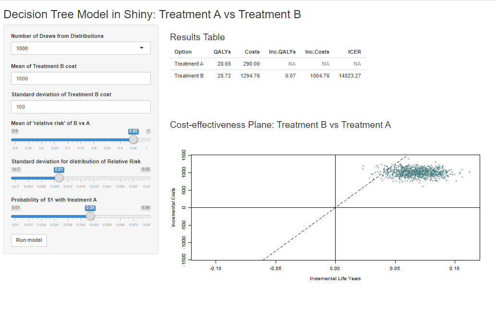

```{r setup, include=FALSE}
knitr::opts_chunk$set(echo = TRUE)
```

\begingroup\small
*^1^ScHARR, University of Sheffield* 

*Corresponding Author: Robert Smith - rasmith3@sheffield.ac.uk*
\endgroup
 

### Abstract

Health economic evaluation models have traditionally been built in Microsoft Excel, but more sophisticated tools are increasingly being used as model complexity and computational requirements increase. Of all the programming languages, R is most popular amongst health economists because it has a plethora of user-created packages and is highly flexible. However, even with an integrated development environments (e.g. R-Studio), R lacks a simple point-and-click user interface and therefore requires some programming ability. This might make the switch from Microsoft Excel to R seem daunting, and it might make it difficult to directly communicate results with decisions makers and other stakeholders.

The R package Shiny has the potential to resolve this limitation. It allows programmers to embed health economic models developed in R into interactive web-browser-based user interfaces. Users can specify their own assumptions about model parameters and run different scenario analyses, which, in case of regular a Markov model, can be computed within seconds. This paper provides a tutorial on how to wrap a health economic model built in R into a Shiny application. We use a 4 state Markov model developed by the Decision Analysis in R for Technologies in Health [@DARTH] group as a case-study to demonstrate main principles and basic functionality. 


A more extensive tutorial, all code, and data are provided in a GitHub repository: [https://robertasmith.github.io/healthecon_shiny/](https://robertasmith.github.io/healthecon_shiny/).


# Introduction
  
As the complexity of health economic models increase, there is growing recognition of the advantages of using high level programming languages to support statistical analysis (e.g. R, Python, C++, Julia). Depending on the model that is being used, Microsoft Excel can be relatively slow. Certain types of models (e.g. individual-level simulations) can take a very long time to run or become computationally infeasible, and some essential statistical methods can hardly be implemented at all (e.g. survival modelling, network meta analysis, value of sample information), and rely on exporting results from other programs (e.g. R, STATA, WinBUGs).

Of all the high level programming languages, R is the most popular amongst health economists [@jalal2017overview]. R is open source, supported by a large community of statisticians, data scientists and health economists. There are extensive collections of (mostly free) online resources, including packages, tutorials, courses, and guidelines. Chunks of code, model functions, and entire models are shared by numerous authors, which allow R users to quickly adopt and adapt methods and code created by others. Importantly for the UK, R is also currently the only programming environment accepted by NICE for HTA submissions, the alternative submission formats Excel, DATA/TreeAge, and WinBUGS are all software applications [@national2014guide]. 

Despite the many strengths of the script-based approach (e.g R) to decision modelling, an important limitation has been the lack of an easy-to-understand user-interface which would be useful as it "facilitates the development and communication of the model structure" [@jalal2017overview, p.743]. While it is common practice for 'spreadsheet models' to have a structured front tab, which allows decision makers to manipulate model assumptions and change parameters to assess their impact on the results, up until recently, R models had to be adapted within script files or command lines.      

Released in 2012, Shiny is an R-package which can be used to create a graphical, web browser based interface. The result looks like a website, and allows users to interact with underlying R models, without the need to manipulate the source code [@beeley2016web]. 
Shiny has already been widely adopted in many different areas and by various organisations, to present the results of statistical analysis [@gendron2016introduction]. With health economics Shiny is currently being used to conduct network meta analysis [@owen2019metainsight] and value of information analysis (@strong2014estimating; @baio2017bceaweb). 

Using Shiny, it is possible to create flexible user interfaces which allow users to specify different assumptions, change parameters, run underlying R code and visualise results. The primary benefit of this is that it makes script based computer models accessible to those with no programming knowledge - opening models up to critical inquiry from decision makers and other stakerholders [@jansen2019developing]. Other benefits come from leveraging the power of R's many publicly available packages, for example allowing for publication quality graphs and tables to be downloaded, user specific data-files uploaded and open-access data automatically updated. Shiny web applications for R health economic models seem particularly useful in cases where model parameters are highly uncertain or unknown, and where analysis may want to be conducted with hetrogeneous assumptions (e.g. for different populations). Once an R model and a Shiny application have been created, they can also be easily adapted, making it possible to quickly update the model when new information becomes available.

While, from a transparency perspective, it is preferable that models constructed in R are made open-access to improve replicability and collaboration, it is not a requirement [@hatswell2017sharing]. Sensitive and proprietary data and/or models can be shared internally, or through password-protected web applications, negating the need to email zipped folders. 

Several authors have postulated that there is considerable potential in using Shiny to support and improve health economic decision making. @incerti2019r identified web applications as being an essential part of modelling, stating that they "believe that the future of cost-effectiveness modeling lies in web apps, in which graphical interfaces are used to run script-based models" (p. 577). Similarly, @baio2017simple predicted that R Shiny web apps will be the "future of applied statistical modelling, particularly for cost-effectiveness analysis" (p.e5). Despite these optimistic prognoses, adoption of R in health economics has been slow and the use of Shiny seems to have been limited to only a few cases. A reason for this might be the lack of accessible tutorials, tailored towards an economic modeller audience.

Here, we provide a simple example of a Shiny web app, using a simple decision tree model which incorporates uncertainty in parameter inputs as an example. The method used is exactly the same regardless of model structure and type, the exact same method can be used for Markov models, microsimulation models and discrete event simulations. 

# Methods

## Model Function

The model function takes six inputs, outlined in Table 1 below, and returns a data-frame of incremental (B compared to A) costs and life years.

**Table 1: Model function inputs**

| Input         | Description                                  | Default Value |
| :-----------  |:---------------------------------------------|:----:|
| n_draws       | Number of draws from parameter distributions | 1000 |
| c_B_tr_mean   | Mean of Treatment Cost of B                  | 1000 |
| c_B_tr_sd     | Standard Deviation of Treatment Cost of B    | 100  |
| rr_mean       | Mean of Relative Risk  of S1 for B vs A      | 0.95 |
| rr_sd         | Standard Relative Risk of S1 for B vs A      | 0.01 |
| p_A_S1        | probability of S1 with treatment A           | 0.05 |

While the focus of this tutorial is on the application of Shiny for health economic models, and therefore it is not important to understand exactly how the model works, we nevertheless provide a brief overview of the decision model. The model is a simple decision tree in which there is a choice between two interventions, intervention A and intervention B. Intervention A results in state 1 with probability *p_A_S1*, and state 2 with probability *p_A_S1*. It has no cost. Intervention B results in state 1 with probability *p_A_S1* $\times$ *rr* and state 2 with probability 1 - (*p_A_S1* $\times$ *rr*). The relative risk is uncertain, but is assumed to be log-normally distributed with mean *rr_mean* and standard deviation *rr_sd*. The one off treatment cost of intervention B is also uncertain, but is assumed to be normally distributed with mean = *c_B_tr_mean* and standard deviation *c_B_tr_sd*. The one off cost of state 1 and state 2 are input as scalars at *c_S1* and *c_S1*. The life years remaining for those in state 1 and state 2 are *ly_S1* and *ly_S2* respectively.

The R function *f_model*, shown below takes the six parameter inputs described in Table 1 and uses them to calculate incremental costs and qalys for this simple model. These are then returned in a data-frame called *df_res*.

```{r echo = T, eval = F}
f_model = function(n_draws     = 1000,      # number of iterations
                   c_B_tr_mean = 1000,      # mean for distribution of costs of B
                   c_B_tr_sd   = 100,       # standard deviation for distribution of costs of B
                   rr_mean     = 0.95,      # mean for distribution of 'relative risk' of B vs A
                   rr_sd       = 0.01,      # standard deviation for distribution of rr 
                   p_A_S1      = 0.05       # probability of S1 with treatment A
                   ) {              
  
# -- Transition Probabilities -- #   
  
  p_A_S2 = 1 - p_A_S1     # probability of S2 with treatment A     
  
  # vector of relative risk from random log-normal distribution.
  rr = rlnorm(n = n_draws,
              meanlog =  log(rr_mean^2 / sqrt(rr_sd^2 + rr_mean^2)),
              sdlog =    sqrt(log(1 + (rr_sd^2 / rr_mean^2)))
              )
  
  p_B_S1 = p_A_S1 * rr    # probability of S1 with treatment B
  
  p_B_S2 = 1-p_B_S1       # prob. of S2 with treatment B
  
# -- Costs -- #
  
  c_S1 = 100             # cost of S1
  c_S2 = 300             # cost of S2
  
  # one off costs for treatment B are from a normal distribution.
  c_B_tr = rnorm(n = n_draws, 
                 mean = c_B_tr_mean,
                 sd = c_B_tr_sd) 
  
# -- Life Years -- #
  
  ly_S1 = 3              # life expectancy in S1
  ly_S2 = 30             # life expectancy in S2
  
# -- Calculate Outcomes -- #
  
  # Costs
  c_A = p_A_S1 * c_S1 + p_A_S2 * c_S2                     # total cost under A
  c_B = p_B_S1 * (c_S1+c_B_tr) + p_B_S2 * (c_S2+c_B_tr)   # total cost under B
  c_incr = c_B - c_A                                      # incremental costs
  
  u_A =  p_A_S1 * ly_S1 + p_A_S2 * ly_S2                      # total life years under A
  u_B =  p_B_S1 * ly_S1 + p_B_S2 * ly_S2                      # total life years under B
  u_incr = u_B - u_A                                          # incremental life years

# -- Calc ICER -- #  
  icer = c_incr / u_incr   # resulting ICER
  
  df_res = data.frame(u_A, u_B, c_A, c_B, c_incr, u_incr, icer) # convert to dataframe
  
  return(df_res)   # return dataframe.
}

```


## Integrating into R-Shiny

Since the model is already wrapped into a function, which takes some inputs and returns a single data-frame of results as output, The next step is to integrate the model function into a Shiny web-app. This is done within a single R file, which we call *app.R*. This can be found here: [https://github.com/RobertASmith/healthecon_shiny/blob/master/DecTree_App/DecTree_app.R](https://github.com/RobertASmith/healthecon_shiny/blob/master/DecTree_App/DecTree_app.R).

The app.R script has three main parts, each are addressed in turn below:
- set-up (getting everything ready so the user-interface and server can be created)
- user interface (what people will see)
- server (stuff going on in the background)

As shown in Figure 1 below, the parameters which are varied in the user interface are a subgroup of inputs into the wrapped up model (the rest of the inputs coming from within the server). The model function has one output, a data-frame of results, which are used within the server to create tables and plots. These are sent back to the user interface to be displayed as shiny outputs. 

\pagebreak


\pagebreak

### Set-up

The set-up is relatively simple, load the R-Shiny package from your library so that you can use the *shinyApp* function. The next step is to use the *source* function in baseR to run the script which creates the *f_model* function, being careful to ensure your relative path is correct ('./model.R' should work if the app.R file is within the same folder). The function *shinyApp* at the end of the app file is reliant on the *shiny* package so please ensure that the *shiny* package is installed, using *install.packages("shiny")* if it is not already. 

```{r, echo = T, eval = F}
# install.packages("shiny") # necessary if you don't already have the function 'shiny' installed.

# we need the function shiny installed, this loads it from the library.
library(shiny)             

# source the wrapper function.
source("./DecTree_App/f_model.R")    

```

### User Interface

The user interface is extremely flexible, we show the code for a very simple structure (fluidpage) with a sidebar containing inputs and a main panel containing outputs. We have done very little formatting in order to minimize the quantity of code while maintaining basic functionality. In order to get an aesthetically pleasing application we recommend much more sophisticated formatting, relying on CSS, HTML and Javascript.

The example user interface displayed in Figure 2 and online at [https://robertasmith.shinyapps.io/sick_sicker/](https://robertasmith.shinyapps.io/sick_sicker/). It is made up of two components, a titlepanel and a sidebar layout display. The sidebarLayout display has within it a sidebar and a main panel. These two components are contained within the *fluidpage* function which creates the user interface (ui).

\pagebreak



\pagebreak

The title panel contains the title "Decision Tree Model in Shiny: Treatment A vs Treatment B", the sidebar panel contains the six model inputs described in Table 1, and an Action Button ("Run / update model"). 

The inputs are of different types, within the six inputs there is one input which is a *selectInput*, two that are *numericInput* and three that are *sliderInput*. The values of the inputs have ID tags (names) which are recognised and used by the server function, we denote these with the prefix "SI" to indicate they are 'Shiny Input' objects (*SI_n_draws*, *SI_c_B_tr_mean*, *SI_c_B_tr_sd*, *SI_rr_mean*, *SI_rr_sd* & *SI_p_A_S1*). Note that this is an addition of the coding framework provided by Alarid-Escudero et al., (2019).

The action button also has an id, this is not an input into the model wrapper *f_model* so we leave out the SI and call it "run_model".

The main panel contains two objects which have been output from the server: *tableOutput("SO_icer_table")* is a table of results, and *plotOutput("SO_CE_plane")* is a cost-effectiveness plane plot. It is important that the format (e.g. tableOutput) matches the format of the object from the server (e.g. *SO_icer_table*). Again, the *SO* prefix reflects the fact that these are Shiny Outputs. The two h3() functions are simply headings which appear as "Results Table" and "Cost-effectiveness Plane".


```{r, echo = T, eval = F}
#================================================================
#                   Create User Interface
#================================================================

ui <- fluidPage(    # create user interface using fluidpage function
  
  titlePanel("Decision Tree Model in Shiny: Treatment A vs Treatment B"),   # title of app
  
  # SIDEBAR
  sidebarLayout(    # indicates layout is going to be a sidebar-layout
    
    sidebarPanel( # open sidebar panel
      
      # input of type dropdown
      selectInput(inputId = "SI_n_draws",                       # id of input, used in server
                   label = "Number of Draws from Distribution", # label above dropdown
                   choices = list(100, 500, 1000, 2000, 5000),  # choices in dropdown box
                   selected = 1000,                             # initial selection
                   multiple = F),                               # allow multiple selections?               
      
      # input of type numeric
      numericInput(inputId = "SI_c_B_tr_mean",      # id of input, used in server
                   label = "Mean for log-normal distribution of costs of B",  # label next to numeric input
                   value = 1000,               # initial value
                   min = 0,                   # minimum value allowed
                   max = 2000),                # maximum value allowed
      
      numericInput(inputId = "SI_c_B_tr_sd",      
                   label = "Standard deviation for log-normal distribution of costs of B",  
                   value = 100,               
                   min = 0,                   
                   max = 200),                
      
      # input of type slider
      sliderInput(inputId = "SI_rr_mean",  # id of input, used in server
                  label = "Mean for distribution of 'relative risk' of B vs A",     # label next to slider input
                  value = 0.95,                 # initial value
                  min = 0.5,                   # minimum value allowed
                  max = 1),                  # maximum value allowed
      
      sliderInput(inputId = "SI_rr_sd",  
                  label = "Standard deviation for distribution of rr",      
                  value = 0.01,                 
                  min = 0.0000001,              
                  max = 0.03),                  
      
      sliderInput(inputId = "SI_p_A_S1",  
                  label = "Probability of S1 with treatment A",      
                  value = 0.05,                 
                  min = 0.01,                  
                  max = 0.08),                  
      
      actionButton(inputId = "run_model",     # id of action button, used in server
                   label   = "Run model")     # action button label (on button)
      
    ),  # close sidebarPanel
    
    mainPanel(                                # open main panel
      
      h3("Results Table"),                    # heading (results table)                
      
      tableOutput(outputId = "SO_icer_table"),   # tableOutput id = icer_table, from server
      
      br(),br(),br(),                           # a set of breaks to give a gap between the results table and plot.
      
      h3("Cost-effectiveness Plane: Treatment B vs Treatment A"),         # heading (Cost effectiveness plane)
      
      plotOutput(outputId = "SO_CE_plane")       # plotOutput id = CE_plane, from server
      
    ) # close mainpanel    
    
  ) # close sidebarlayout
  
) # close UI fluidpage

```

### Server

The server is marginally more complicated than the user interface. It is created by a function with inputs and outputs. The observe event indicates that when the action button (run_model) is pressed the code within the curly brackets is run. The code will be re-run if the button is pressed again. 

The first thing that happens when the run_model button is pressed is that the model wrapper function *f_wrapper* is run with the user interface inputs (*SI_n_draws*, *SI_c_B_tr_mean*, *SI_c_B_tr_sd*, *SI_rr_mean*, *SI_rr_sd* & *SI_p_A_S1*) as inputs to the function. The *input$* prefix indicates that the objects have come from the user interface. The results of the model are stored as the dataframe object *df_model_res*.

The ICER table is then created and output (note the prefix *output$*) in the object *SO_icer_table*. See previous section on the user interface and note that the *tableOutput* function has as an input *SO_icer_table*. The function *renderTable* rerenders the table continuously so that the table always reflects the values from the data-frame of results created above. In this simple example we have created a table of results using code within the script. In reality we would generally use a custom function which creates a publication quality table which is aesthetically pleasing. There are numerous packages which provide this functionality (e.g. BCEA, Darthpack, Heemod)

The cost-effectiveness plane is created in a similar process, using the *renderPlot* function to continuously update a plot which is created using baseR plot function using incremental costs and QALYs calculated from the results dataframe *df_model_res*. For aesthetic purposes we recommend this is replaced by a ggplot or plotly plot which has much improved functionality. Again, there are packages available for this (e.g. Heemod, BCEA, Darthpack)

```{r, echo = T, eval = F}
#================================================================
#                     Create Server Function
#================================================================

server <- function(input, output){   # server = function with two inputs
  
  observeEvent(input$run_model,       # when action button pressed ...
               ignoreNULL = F, {
                 
                 # Run model wrapper function with the Shiny inputs and store as data-frame 
                 df_model_res = f_model(n_draws     = input$SI_n_draws,      # number of PSA iterations
                                        c_B_tr_mean = input$SI_c_B_tr_mean,  # mean costs of B
                                        c_B_tr_sd   = input$SI_c_B_tr_sd,    # max costs of B
                                        rr_mean     = input$SI_rr_mean,      # Mean Relative risk under B
                                        rr_sd       = input$SI_rr_sd,        # standard deviation of rr
                                        p_A_S1      = input$SI_p_A_S1        # prob. of S1 with treatment A
                                        )
                
                 
                 #--- CREATE COST EFFECTIVENESS PLANE ---#
                 output$SO_icer_table <- renderTable({ # this continuously updates table
                   
                   df_res_table <- data.frame( # create dataframe
                     
                     Option =  c("Treatment A", "Treatment B"), # treatment names
                     
                     Life Years  =  c(mean(df_model_res$u_A),mean(df_model_res$u_B)), # mean life years for each
                     
                     Costs  =  c(mean(df_model_res$c_A),mean(df_model_res$c_B)),      # mean costs for each
                     
                     Inc.LifeYears = c(NA, mean(df_model_res$u_incr)),                # incremental life years B vs A          
                     
                     Inc.Costs = c(NA, mean(df_model_res$c_incr)),                    # incremental cost B vs A
                     
                     ICER = c(NA, mean(df_model_res$c_incr)/mean(df_model_res$u_incr)) # LifeYears/Pound B vs A
                   )
                   
                   # round the dataframe to two digits so looks tidier
                   df_res_table[,2:6] <- round(df_res_table[,2:6],digits = 2) 
                   
                   #print the dataframe
                   df_res_table
                   
                 }) # table plot end.
                 
                 
                 #---  CREATE COST EFFECTIVENESS PLANE ---#
                 output$SO_CE_plane <- renderPlot({ # render plot repeatedly updates.
                   
                  # baseR plot
                  plot(x=df_model_res$u_incr,    # x axis is incremental life years
                        y=df_model_res$c_incr,   # y axis is incremental costs
                        cex=0.8,                 # made slightly smaller to look tidier
                        col="cadetblue4",        # color set to a type of blue
                        xlab = "Incremental Life Years",
                        ylab = "incremental Costs",
                        xlim = c(min(df_model_res$u_incr,df_model_res$u_incr*-1), # set limits for x-axis
                                max(df_model_res$u_incr,df_model_res$u_incr*-1)),
                        ylim = c(min(df_model_res$c_incr,df_model_res$c_incr*-1), # set limits for y-axis
                                max(df_model_res$c_incr,df_model_res$c_incr*-1)))
                   abline(h=0,v=0)               # straight vertical and horizontal lines at zero.
                   abline(coef= c(0,25000),lty=2)# dotted line at lambda = 25000.
                    
                 }) # renderplot end
                 
               }) # Observe Event End
  
  
} # Server end
  
```  

### Running the app
The app can be run within the R file using the function *shinyApp* which depends on the *ui* and *server* which have been created and described above. Running this creates a Shiny application in the local environment (e.g. your desktop). In order to deploy the application onto the web the app needs to be *published* using the publish button in the top right corner of the R-file in RStudio (next to run-app). A step by step guide to this process can be found on the R-Shiny website [https://shiny.rstudio.com/deploy/](https://shiny.rstudio.com/deploy/). 

```{r, echo = T, eval = F}
## ----- run app------

shinyApp(ui, server)
```

### Additional Functionality

The example Decision Tree web-app which has been created is a simple, but functional, R-Shiny user interface for a health economic model. The process of creating a shiny app does not increase with model complexity, as long as the model can be wrapped into a function with inputs and outputs one could follow the same process for any other model type.

There are a number of additional functionalities which we have used for various projects:

- ability to fully customise the aesthetics of the user interface similar to standard web-design.

- ability to upload files containing input parameters to the app before running the model.

- ability to download figures and tables from the app.

- ability to download a full markdown report which updates all numbers, tables and figures in the report based on the user inputs and model outputs.

- ability to have results (in a PDF report) sent to an email address once the model has finished.

- ability to select the comparitor and treatment(s) where multiple treatments exist.

It is also possible to integrate network meta-analysis (NMA), the economic model, and value of information analysis (VOI) in a single application. After selecting NMA inputs (e.g. a subgroup of effectiveness studies) and economic model inputs (e.g. costs of treatments) and then clicking the 'run' button, a user would be presented with results of the NMA, economic model and VOI in one simple user-interface. They would then be able to download a report with all of the relevant information updated (e.g. numbers, tables, figures). We believe this is the future of health economics.


# Discussion

In this paper, we demonstrated how to generate a user-friendly interface for an economic model programed in R, using the shiny package. This tutorial shows that the process is relatively simple and requires limited additional programming knowledge than that required to build a decision model in R.

The movement towards script based health economic models with web based user interfaces is particularly useful in situations where a general model structure has been created with a variety of stakeholders in mind, each of which may have different input parameters and wish to conduct sensitivity analysis specific to their decision. For example the World Health Organisation Department of Sexual and Reproductive Health and Research recently embedded a Shiny application into their website  [https://srhr.org/fgmcost/cost-calculator/](https://srhr.org/fgmcost/cost-calculator/). The application runs a heemod model [@heemod] in R in an external server, and allows users to select their country and change country specific input parameters, run the model and display results. The process of engagement, the ability to 'play' with the model and test the extremes of the decision makers' assumptions gives stakeholders more control over models, making them feel less like black boxes. While there is a danger that a mis-informed stakeholder may make a mistake in their choice of parameter, we should remember that the role of the model is to inform decision-makers not instruct them, and besides: it is simple to limit the range that parameter inputs can take.

The authors' experience of creating user-interfaces for decision models has led us to the conclusion that the most efficient method is to work iteratively, first ensuring that the model is working as intended before making incremental changes to the user interface and server one item at a time. While experienced programmers can make substantial time savings by combining multiple steps we have found that the time taken to correct mistakes far outweighs the time savings associated with combining steps.

There are several challenges that exist with the movement toward script based models with web-based user-interfaces. The first is the challenge of upskilling health economists used to working in Microsoft Excel. We hope that this tutorial provides a useful addition to previous tutorials demonstrating how to construct decsion models in R [@alarid2020cohort]. A second, and crucial challenge to overcome, is a concern about deploying highly sensitive data and methods to an external server. While server providers such as ShinyIO provide assurances of SSR encryption and user authentication clients with particularly sensitive data may still have concerns. This problem can be avoided in two ways: firstly if clients have their own server and the ability to deploy applications they can maintain control of all data and code, and secondly the application could simply not be deployed, and instead simply created during a meeting using code and data shared in a zip file. Finally, a challenge (and opportunity) exists to create user-interfaces that are most user-friendly for decision makers in this field, this is an area of important research which can be used to inform teaching content for years to come.

# Conclusion

The creation of web application user interfaces for health economic models constructed in high level programming languages should improve their usability, allowing stakeholders and third parties with no programming knowledge to conduct their own sensitivity analysis remotely. This tutorial provides a reference for those attempting to create a user interface for a health economic model created in R. Further work is necessary to better understand how to design interfaces which best meet the needs of different decision makers. 

# References


