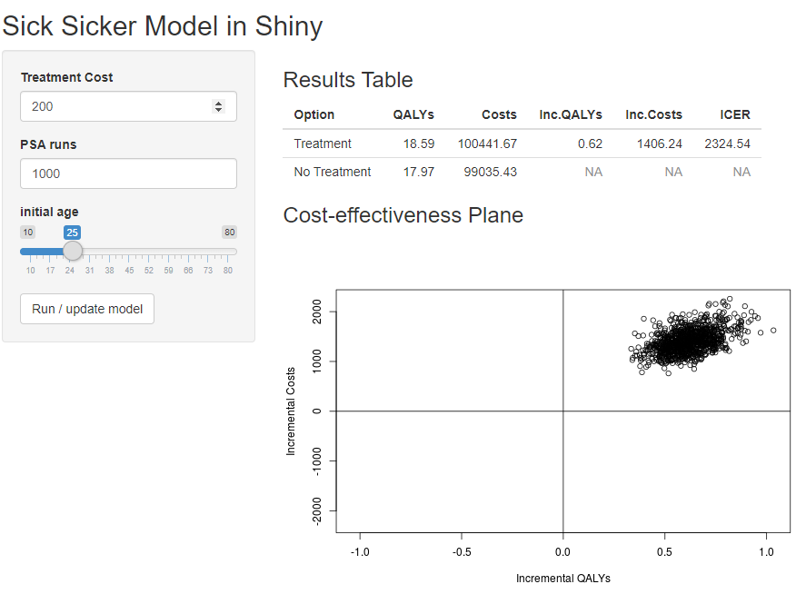

```{r setup, include=FALSE}
knitr::opts_chunk$set(echo = TRUE)
```

\begingroup\small
*^1^ScHARR, University of Sheffield* 

*Corresponding Author: Robert Smith - rasmith3@sheffield.ac.uk*
\endgroup
 

### Abstract

Health economic models have traditionally been built in Microsoft Excel, but more sophisticated tools are increasingly being used as model complexity and computational requirements increase. Of all the programming languages, R is most popular amongst health economists because it has a plethora of user created packages and is highly flexible, transparent and adaptable. However, the use of R requires some programming ability, as it does not have a simple point-and-click user interface. This might make the switch from Microsoft Excel to R seem daunting, and it might make it difficult to directly communicate results with decisions makers and other stakeholders.

The R package 'Shiny' has the potential to resolve this limitation. It allows programmers to embed health economic models developed in R into interactive web-browser based user interfaces. Users can specify their own assumptions about model parameters and run different scenario analyses, which, in case of regular a Markov model, can be computed within seconds. This paper provides a tutorial on how to wrap a health economic model built in 'R' into a Shiny application. We use a 4 state Markov model developed by the Decision Analysis in R for Technologies in Health (DARTH) group as a case-study to demonstrate main principles and basic functionality. 


A more extensive tutorial, all code and data are provided on a GitHub repository: [https://robertasmith.github.io/healthecon_shiny/](https://robertasmith.github.io/healthecon_shiny/).


# Introduction
  
As the complexity of health economic models increase, there is growing recognition of the advantages of using high level programming languages to support statistical analysis (e.g. R, Python, C++). Depending on the model that is being used, Microsoft Excel can be relatively slow. Certain types of models (e.g. individual-level simulations) can take a very long time to run or become computationally infeasible, and some essential statistical methods can hardly be implemented at all (e.g. survival modelling, network meta analysis, value of sample information), and rely on exporting results from other programs (e.g. R, STATA, WinBUGs).

Of all the high level programming languages, R is the most popular amongst health economists (Jalal et al. 2017). R is open source, supported by a large community of statisticians, data scientists and health economists. There are extensive collections of (mostly free) online resources, including packages, tutorials, courses, and guidelines. Chunks of code, model functions, and entire models are shared by numerous authors, which allow R users to quickly adopt and adapt methods and code created by others. Importantly for the UK, R is also currently the only programming environment accepted by NICE for HTA submissions, the alternative submission formats Excel, DATA/Treeage, and WinBUGs are all software applications (NICE, 2014). 

Despite the many strengths of the script based approach (e.g R) to decision modelling, an important limitation has been the lack of an easy-to-understand user-interface which would be useful as it "facilitates the development and communication of the model structure" (Jalel et al. 2017, p.743). While it is common practice for 'spreadsheet models' to have a structured front tab, which allows decision makers to manipulate model assumptions and change parameters to assess their impact on the results, up until recently, R models had to be adapted within script files or command lines.      

Released in 2012, Shiny is an R-package which can be used to create a graphical, web browser based interface. The result looks like a website, and allows users to interact with underlying R models, without the need to manipulate the source code (Beely, 2013). 
Shiny has already been widely adopted in many different areas and by various organisations, to present the results of statistical analysis (Gendron, 2016). With health economics Shiny is currently being used to conduct network meta analysis (Owen et al., 2019) and value of information analysis (Strong et al., 2014). 

Using Shiny, it is possible to create flexible user interfaces which allow users to specify different assumptions, change parameters, run underlying R code and visualise results. The primary benefit of this is that it makes script based computer models accessible to those with no programming knowledge - opening models up to critical inquiry from decision makers and other stakerholders (Jansen et al., 2019). Other benefits come from leveraging the power of R its many publicly available packages, for example allowing for publication quality graphs and tables to be downloaded, user specific data-files uploaded, open-access data automatically updated and, perhaps most importantly, to efficiently run comprehensive probabilistic sensitivity analyses in a fraction of the time that it would take in Microsoft Excel. Shiny web applications for R health economic models seem particularly useful in cases where model parameters are highly uncertain or unknown, and where analysis may want to be conducted with hetrogeneous assumptions (e.g. for different populations). Once an R model and a Shiny application have been created, they can also be easily adapted, making it possible to quickly update the model when new information becomes available.

While, from a transparency perspective, it is preferable that models constructed in R are made open-access to improve replicability and collaboration, it is not a requirement (Hatswell & Chandler, 2017). Sensitive and proprietary data and/or models can be shared internally, or through password-protected web applications, negating the need to email zipped folders. 

Several authors have postulated that there is considerable potential in using Shiny to support and improve health economic decision making. Incerti et al. (2019) identified web applications as being an essential part of modelling, stating that they "believe that the future of cost-effectiveness modeling lies in web apps, in which graphical interfaces are used to run script-based models" (p. 577). Similarly, Baio & Heath (2017) predicted that R Shiny web apps will be the "future of applied statistical modelling, particularly for cost-effectiveness analysis" (p.e5). Despite these optimistic prognoses, adoption of R in health economics has been slow and the use of Shiny seems to have been limited to only a few cases. A reason for this might be the lack of accessible tutorials, tailored towards an economic modeller audience.

Here, we provide a simple example of a Shiny web app, using a general 4-state Markov model. The model is based on the 'Sick-Sicker model', which has been described in detail in previous publications (Krijkamp et al., 2020; Alarid-Escudero et al., 2020) and in open source teaching materials by the DARTH workgroup (Decision Analysis in R for Technologies in Health, 2019). The model was slightly adapted to implement probabilistic sensitivity analysis.

# Methods

While the focus of this tutorial is on the application of Shiny for health economic models, below we provide a brief overview of the "Sick-Sicker model". For further details, readers are encouraged to consult Alarid-Escudero et al., 2019, Krijkamp et al., 2020 and the DARTH group website [http://darthworkgroup.com/](http://darthworkgroup.com/).

The Sick-Sicker model is a 4 state (Healthy, Sick, Sicker or Dead) Markov model. The cohort progresses through the model in cycles of equal duration, with the proportion of those in each health state in the next cycle being dependant on the proportion in each health state in the current cycle and a constant transition probability matrix.

The analysis incorporates probabilistic sensitivity analysis (PSA) by creating a data-frame of PSA inputs (one row being one set of model inputs) based on cost, utility and probability distributions using the function *f_gen_psa* and then running the model with each set of PSA inputs using the model function *f_MM_sicksicker*. We therefore begin by describing the two functions *f_gen_psa* and *f_MM_sicksicker* in more detail before moving on to demonstrate how to create a user-interface. Note that we add to the coding framework from Alarid-Escudero et al., (2019) to use the *f_* prefix for functions.

## Functions

### Creating PSA inputs.

The f_gen_psa function returns a data-frame of probabilistic sensitivity analysis inputs: transition probabilities between health states using a beta distribution, hazard rates using a log-normal distribution, costs using a gamma distribution and utilities using a truncnormal distribution. It relies on two inputs, the number of simulations (PSA inputs), and the cost (which takes a fixed value). We set the defaults to 1000 and 50 respectively.

NOTE: in order to use the *rtruncnorm* function the user must first install and load the 'truncnorm' package using *install.packages* and *library()*. 

```{r echo = T, eval = F}
f_gen_psa <- function(n_sim = 1000, c_Trt = 50){
   
  df_psa <- data.frame(
    
    # Transition probabilities (per cycle)
    p_HS1   = rbeta(n_sim, 30, 170),        # prob Healthy -> Sick
    p_S1H   = rbeta(n_sim, 60, 60) ,        # prob Sick    -> Healthy
    p_S1S2  = rbeta(n_sim, 84, 716),        # prob Sick    -> Sicker
    
    p_HD    = rbeta(n_sim, 10, 1990)      ,  # prob Healthy -> Dead
    hr_S1   = rlnorm(n_sim, log(3),  0.01),  # rate ratio death S1 vs healthy
    hr_S2   = rlnorm(n_sim, log(10), 0.02),  # rate ratio death S2 vs healthy 
    
    # Cost vectors with length n_sim
    c_H   = rgamma(n_sim, shape = 100, scale = 20)    , # cost p/cycle in state H
    c_S1  = rgamma(n_sim, shape = 177.8, scale = 22.5), # cost p/cycle in state S1
    c_S2  = rgamma(n_sim, shape = 225, scale = 66.7)  , # cost p/cycle in state S2
    c_D   = 0                                         , # cost p/cycle in state D
    c_Trt = c_Trt,                                   # cost p/cycle of treatment
    
    # Utility vectors with length n_sim 
    u_H   = rtruncnorm(n_sim, mean =    1, sd = 0.01, b = 1), # utility when healthy
    u_S1  = rtruncnorm(n_sim, mean = 0.75, sd = 0.02, b = 1), # utility when sick
    u_S2  = rtruncnorm(n_sim, mean = 0.50, sd = 0.03, b = 1), # utility when sicker
    u_D   = 0                                               , # utility when dead
    u_Trt = rtruncnorm(n_sim, mean = 0.95, sd = 0.02, b = 1)  # utility when being treated
  )
  
  return(df_psa)
}

```

### Running the model for a specific set of PSA inputs
The function *f_MM_sicksicker* makes use of the *with* function which applies an expression (in this case the rest of the code) to a dataset (in this case params, which will be a row of PSA-inputs). It uses the params (one row of PSA inputs) to create a transition probability matrix *m_P*, and then moves the cohort through the simulation one cycle at a time, recording the proportions in each health state in a markov trace *m_TR* and applying the transition matrix to calculate the proportions in each health state in the next period *m_TR[t+1,]*. The function returns a vector of five results: Cost with no treatment, Cost with treatment, QALYs with no treatment and QALYs with treatment and an ICER. In this simple example treatment only influences utilities and costs, not transition probabilities

```{r echo = T, eval = F}

f_MM_sicksicker <- function(params) {
  with(as.list(params), {
    
    # compute internal parameters as a function of external parameter
    r_HD    = - log(1 - p_HD) # rate of death in healthy
    r_S1D   = hr_S1 * r_HD 	  # rate of death in sick
    r_S2D   = hr_S2 * r_HD  	# rate of death in sicker
    p_S1D   = 1 - exp(-r_S1D) # probability to die in sick
    p_S2D   = 1 - exp(-r_S2D) # probability to die in sicker
    
    # calculate discount weight for each cycle based on discount rate d_r
    v_dwe <- v_dwc <- 1 / (1 + d_r) ^ (0:n_t) 
    
    # create transition probability matrix for NO treatment
    m_P <- matrix(0,
                  nrow = n_states, ncol = n_states,
                  dimnames = list(v_n, v_n))
    # fill in the transition probability array
    ### From Healthy
    m_P["H", "H"]  <- 1 - (p_HS1 + p_HD)
    m_P["H", "S1"] <- p_HS1
    m_P["H", "D"]  <- p_HD
    ### From Sick
    m_P["S1", "H"]  <- p_S1H
    m_P["S1", "S1"] <- 1 - (p_S1H + p_S1S2 + p_S1D)
    m_P["S1", "S2"] <- p_S1S2
    m_P["S1", "D"]  <- p_S1D
    ### From Sicker
    m_P["S2", "S2"] <- 1 - p_S2D
    m_P["S2", "D"]  <- p_S2D
    ### From Dead
    m_P["D", "D"] <- 1
    
    # create Markov trace (n_t + 1 because R doesn't understand  Cycle 0)
    m_TR <- matrix(NA, nrow = n_t + 1 , ncol = n_states, 
                   dimnames = list(0:n_t, v_n))     
    
    m_TR[1, ] <- c(1, 0, 0, 0)          # initialize Markov trace
    
    ############# PROCESS ###########################################
      
    
    for (t in 1:n_t){ # throughout the number of cycles
      # estimate the Markov trace for cycle the next cycle (t + 1)
      m_TR[t + 1, ] <- m_TR[t, ] %*% m_P           
    }
    
    ############ OUTPUT  ###########################################
    
    # create vectors of utility and costs for each state
    v_u_trt    <- c(u_H, u_Trt, u_S2, u_D)
    v_u_no_trt <- c(u_H, u_S1, u_S2, u_D)
    
    v_c_trt    <- c(c_H, c_S1 + c_Trt, c_S2 + c_Trt, c_D)
    v_c_no_trt <- c(c_H, c_S1, c_S2, c_D)
    
    # estimate mean QALys and costs
    v_E_no_trt <- m_TR %*% v_u_no_trt
    v_E_trt    <- m_TR %*% v_u_trt
    
    v_C_no_trt <- m_TR %*% v_c_no_trt
    v_C_trt    <- m_TR %*% v_c_trt
    
    ### discount costs and QALYs
    te_no_trt <- t(v_E_no_trt) %*% v_dwe  # 1x31 %*% 31x1 -> 1x1
    te_trt    <- t(v_E_trt) %*% v_dwe
    
    tc_no_trt <- t(v_C_no_trt) %*% v_dwc
    tc_trt    <- t(v_C_trt)    %*% v_dwc
    
    results <- c("Cost_NoTrt" = tc_no_trt, 
                 "Cost_Trt"   = tc_trt, 
                 "QALY_NoTrt" = te_no_trt, 
                 "QALY_Trt"   = te_trt,
                 "ICER"       = (tc_trt - tc_no_trt)/(te_trt - te_no_trt))
    
    return(results)
  }
  )
}
```

## Creating the model wrapper

When using a web application it is likely that the user will want to be able to change parameter inputs and re-run the model. In order to make this simple, we recommend wrapping the entire model into a function. We call this function *f_wrapper*, using the prefix *f_* to denote that this is a function.

The wrapper function has as its inputs all the parameters which we may wish to vary using R-Shiny. We set the default values to those of the base model in any report/publication. The model then generates PSA inputs using the *f_gen_psa* function, creates an empty table of results, and runs the model for each set of PSA inputs (a row from *df_psa*) in turn. The function then returns the results in the form of a dataframe with n=5 columns and n=psa rows. The columns contain the costs and qalys for treatment and no treatment for each PSA run, as well as an ICER for that PSA run.

```{r, echo = T, eval = F}
f_wrapper <- function(
  
  #================================================================
  #                       User adjustable inputs
  #================================================================
  n_age_init = 25,   # age at baseline default is 25
  n_age_max  = 110,  # maximum age of follow up default is 110
  d_r     = 0.035,   # discount rate for costs & QALYS (NICE 3.5%)
  n_sim   = 1000,    # number of simulations default 1000
  c_Trt   = 50       # cost of treatment default 50

  ){
  
  #================================================================
  #                       Unadjustable inputs
  #================================================================
  n_t <- n_age_max - n_age_init # time horizon, number of cycles
  v_n <- c("H", "S1", "S2", "D") # the 4 health states of the model:
  n_states <- length(v_n) # number of health states 

  #================================================================
  #                       Create PSA Inputs
  #================================================================
  
  df_psa <- f_gen_psa(n_sim = n_sim, c_Trt =  c_Trt)

  #================================================================
  #                       Run PSA
  #================================================================

  # Initialize matrix of results outcomes
  m_out <- matrix(NaN, 
                 nrow = n_sim, 
                 ncol = 5,
                 dimnames = list(1:n_sim,c("Cost_NoTrt", "Cost_Trt",
                                           "QALY_NoTrt", "QALY_Trt",
                                           "ICER")))
  # loop through psa inputs running the model for each.
  for(i in 1:n_sim){
    # store results in one row of results matrix
    m_out[i,] <- f_MM_sicksicker(df_psa[i, ])
    
    # display the progress of the simulation
    cat('\r', paste(round(i/n_sim * 100), "% done", sep = " "))       
  }
  
  #================================================================
  #                      Return results
  #================================================================
  
  df_out <- as.data.frame(m_out) # convert matrix to dataframe (for plots)
  
  return(df_out) # output the dataframe from the function
  
  }

```

## Integrating into R-Shiny

The method so far has involved wrapping the model into a function, which takes some inputs and returns a single data-frame output. The next step is to integrate the model function into a Shiny web-app. This is done within a single R file, which we call *app.R*. This can be found here: [https://github.com/RobertASmith/healthecon_shiny/tree/master/App](https://github.com/RobertASmith/healthecon_shiny/tree/master/App).

The app.R script has three main parts, each are addressed in turn below:
- set-up (getting everything ready so the user-interface and server can be created)
- user interface (what people will see)
- server (stuff going on in the background)

### Set-up

The set-up is relatively simple, load the R-Shiny package from your library so that you can use the *shinyApp* function. The next step is to use the *source* function in baseR to run the script which creates the *f_wrapper* function, being careful to ensure your relative path is correct ('./wrapper.R' should work if the app.R file is within the same folder). The function *shinyApp* at the end of the app file is reliant on the *shiny* package so please ensure that the *shiny* package is installed, using *install.packages("shiny")* if it is not. 

```{r, echo = T, eval = F}
# install.packages("shiny") # necessary if you don't already have the function 'shiny' installed.

# we need the function shiny installed, this loads it from the library.
library(shiny)             

# source the wrapper function.
source("./wrapper.R")   

```

### User Interface

The user interface is extremely flexible, we show the code for a very simple structure (fluidpage) with a sidebar containing inputs and a main panel containing outputs. We have done very little formatting in order to minimize the quantity of code while maintaining basic functionality. In order to get an aesthetically pleasing application we recommend much more sophisticated formatting, relying on CSS, HTML and Javascript.

The example user interface displayed in Figure 1 and online at [https://robertasmith.shinyapps.io/sick_sicker/](https://robertasmith.shinyapps.io/sick_sicker/). It is made up of two components, a titlepanel and a sidebar layout display. The sidebarLayout display has within it a sidebar and a main panel. These two components are contained within the *fluidpage* function which creates the user interface (ui).

\pagebreak

**Figure 1: ScreenPrint of Sick-Sicker user interface**


\pagebreak

The title panel contains the title "Sick Sicker Model in Shiny", the sidebar panel contains two numeric inputs and a slider input ("Treatment Cost", "PSA runs", "Initial Age") and an Action Button ("Run / update model"). 

The values of the inputs have ID tags (names) which are recognised and used by the server function, we denote these with the prefix "SI" to indicate they are 'Shiny Input' objects (*SI_c_Trt*, *SI_n_sim*, *SI_n_age_init*). Note that this is an addition of the coding framework provided by Alarid-Escudero et al., (2019).

The action button also has an id, this is not an input into the model wrapper (f_wrapper) so we leave out the SI and call it "run_model".

The main panel contains two objects which have been output from the server: *tableOutput("SO_icer_table")* is a table of results, and *plotOutput("SO_CE_plane")* is a cost-effectiveness plane plot. It is important that the format (e.g. tableOutput) matches the format of the object from the server (e.g. *SO_icer_table*). Again, the *SO* prefix reflects the fact that these are Shiny Outputs. The two h3() functions are simply headings which appear as "Results Table" and "Cost-effectiveness Plane".


```{r, echo = T, eval = F}
  #================================================================
  #                   Create User Interface
  #================================================================

ui <- fluidPage(    # creates empty page, which we will fill
  
  titlePanel("Sick Sicker Model in Shiny"),   # title of app
  
  # SIDEBAR
  sidebarLayout(    # indicates layout is going to be a sidebar-layout
    
    sidebarPanel( # open sidebar panel
    
    numericInput(inputId = "SI_c_Trt",      # id of input, used in server
                 label = "Treatment Cost",  # label next to numeric input
                 value = 200,               # initial value
                 min = 0,                   # minimum value allowed
                 max = 400),                # maximum value allowed
    
    numericInput(inputId = "SI_n_sim",      # id of input, used in server
                 label = "PSA runs",        # label next to numeric input
                 value = 1000,              # initial value
                 min = 0,                   # minimum value allowed
                 max = 400),                # maximum value allowed
    
    sliderInput(inputId = "SI_n_age_init",  # id of input, used in server
                label = "Initial Age",      # label next to numeric input
                value = 25,                 # initial value
                min = 10,                   # minimum value allowed
                max = 80),                  # maximum value allowed
    

    actionButton(inputId = "run_model",     # id of action button, used in server
                 label   = "Run model")     # action button label (on button)
                       
                ),  # close sidebarPanel
    
  mainPanel(                                # open main panel
    
    h3("Results Table"),                    # heading (results table)                
    
    tableOutput(outputId = "SO_icer_table"),   # tableOutput id = icer_table, from server
    
    h3("Cost-effectiveness Plane"),         # heading (Cost effectiveness plane)
    
    plotOutput(outputId = "SO_CE_plane")       # plotOutput id = CE_plane, from server
    
            ) # close mainpanel    
      
      ) # close sidebarlayout
                     
  ) # close UI fluidpage

```

### Server

The server is marginally more complicated than the user interface. It is created by a function with inputs and outputs. The observe event indicates that when the action button (run_model) is pressed the code within the curly brackets is run. The code will be re-run if the button is pressed again. 

The first thing that happens when the run_model button is pressed is that the model wrapper function *f_wrapper* is run with the user interface inputs (*SI_c_Trt*, *SI_n_age_init*, *SI_n_sim*) as inputs to the function. The *input$* prefix indicates that the objects have come from the user interface. The results of the model are stored as the dataframe object *df_model_res*.

The ICER table is then created and output (note the prefix *output$*) in the object *SO_icer_table*. See previous section on the user interface and note that the *tableOutput* function has as an input *SO_icer_table*. The function *renderTable* rerenders the table continuously so that the table always reflects the values from the data-frame of results created above. In this simple example we have created a table of results using code within the script. In reality we would generally use a custom function which creates a publication quality table which is aesthetically pleasing. There are numerous packages which provide this functionality (e.g. BCEA, Darthpack, Heemod)

The cost-effectiveness plane is created in a similar process, using the *renderPlot* function to continuously update a plot which is created using baseR plot function using incremental costs and QALYs calculated from the results dataframe *df_model_res*. For aesthetic purposes we recommend this is replaced by a ggplot or plotly plot which has much improved functionality. Again, there are packages available for this (e.g. Heemod, BCEA, Darthpack)

```{r, echo = T, eval = F}
  #================================================================
  #                     Create Server Function
  #================================================================

server <- function(input, output){   # server = function with two inputs
  
 observeEvent(input$run_model,       # when action button pressed ...
              ignoreNULL = F, {
    
  # Run model wrapper function with the Shiny inputs and store as data-frame 
  df_model_res = f_wrapper(c_Trt = input$SI_c_Trt,
                           n_age_init = input$SI_n_age_init,
                           n_sim = input$SI_n_sim)
    
  
    #--- CREATE COST EFFECTIVENESS TABLE ---#
    output$SO_icer_table <- renderTable({ # this continuously updates table
      
      df_res_table <- data.frame( # create dataframe
        
        Option =  c("Treatment","No Treatment"), 
        
        QALYs  =  c(mean(df_model_res$QALY_Trt),mean(df_model_res$QALY_NoTrt)),
        
        Costs  =  c(mean(df_model_res$Cost_Trt),mean(df_model_res$Cost_NoTrt)),
        
        Inc.QALYs = c(mean(df_model_res$QALY_Trt) - mean(df_model_res$QALY_NoTrt),NA),
        
        Inc.Costs = c(mean(df_model_res$Cost_Trt) - mean(df_model_res$Cost_NoTrt),NA),
        
        ICER = c(mean(df_model_res$ICER),NA)
      )
      
      # round the dataframe to two digits so looks tidier
      df_res_table[,2:6] <- round(df_res_table[,2:6],digits = 2) 
      
      # print the results table
      df_res_table

      }) # table plot end.
    
    
   #---  CREATE COST EFFECTIVENESS PLANE ---#
    output$SO_CE_plane <- renderPlot({ # render plot repeatedly updates.
      
      # calculate incremental costs and qalys from results dataframe
      df_model_res$inc_C <- df_model_res$Cost_Trt - df_model_res$Cost_NoTrt
      df_model_res$inc_Q <- df_model_res$QALY_Trt - df_model_res$QALY_NoTrt
      
      # create cost effectiveness plane plot
      plot(x = df_model_res$inc_Q, # x axis incremental QALYS
           y = df_model_res$inc_C, # y axis incremental Costs
           #label axes
           xlab = "Incremental QALYs", 
           ylab = "Incremental Costs", 
           
           # set xlimits and ylimits for plot.
           xlim = c(min(df_model_res$inc_Q,df_model_res$inc_Q*-1),
                    max(df_model_res$inc_Q,df_model_res$inc_Q*-1)),
           ylim = c(min(df_model_res$inc_C,df_model_res$inc_C*-1),
                    max(df_model_res$inc_C,df_model_res$inc_C*-1)),
           # include y and y axis lines.
           abline(h = 0,v=0)
          ) # plot end 
    }) # renderplot end
    
 }) # Observe Event End
    
    
  } # Server end
  
```  

### Running the app
The app can be run within the R file using the function *shinyApp* which depends on the *ui* and *server* which have been created and described above. Running this creates a Shiny application in the local environment (e.g. your desktop). In order to deploy the application onto the web the app needs to be *published* using the publish button in the top right corner of the R-file in RStudio (next to run-app). A step by step guide to this process can be found on the R-Shiny website [https://shiny.rstudio.com/deploy/](https://shiny.rstudio.com/deploy/). 

```{r, echo = T, eval = F}
## ----- run app------

shinyApp(ui, server)
```

### Additional Functionality

The example Sick-Sicker web-app which has been created is a simple, but functional, R-Shiny user interface for a health economic model. There are a number of additional functionalities which we have used for various projects:

- ability to fully customise the aesthetics of the user interface similar to standard web-design.

- ability to upload files containing input parameters to the app before running the model.

- ability to download figures and tables from the app.

- ability to download a full markdown report which updates all numbers, tables and figures in the report based on the user inputs and model outputs.

- ability to select the comparitor and treatment(s) where multiple treatments exist.

It is also possible to integrate network meta-analysis (NMA), the economic model, and value of information analysis (VOI) in a single application. After selecting NMA inputs (e.g. a subgroup of effectiveness studies) and economic model inputs (e.g. costs of treatments) and then clicking the 'run' button, a user would be presented with results of the NMA, economic model and VOI in one simple user-interface. They would then be able to download a report with all of the relevant information updated (e.g. numbers, tables, figures). We believe this is the future of health economics.


# Discussion

In this paper, we demonstrated how to generate a user-friendly interface for an economic model programed in R, using the Shiny package. This tutorial shows that the process is relatively simple and requires limited additional programming knowledge than that required to build a decision model in R.

The movement towards script based health economic models with web based user interfaces is particularly useful in situations where a general model structure has been created with a variety of stakeholders in mind, each of which may have different input parameters and wish to conduct sensitivity analysis specific to their decision. For example the World Health Organisation Department of Sexual and Reproductive Health and Research recently embedded a Shiny application into their website (https://srhr.org/fgmcost/cost-calculator/). The application runs a heemod model in R in an external server, and allows users to select their country and change country specific input parameters, run the model and display results. The process of engagement, the ability to 'play' with the model and test the extremes of the decision makers' assumptions gives stakeholders more control over models, making them feel less like black boxes. While there is a danger that a mis-informed stakeholder may make a mistake in their choice of parameter, we should remember that the role of the model is to inform decision-makers not instruct them ... and besides: it is simple to limit the range that parameter inputs can take.

The authors' experience of creating user-interfaces for decision models has led us to the conclusion that the most efficient method is to work iteratively, first ensuring that the model is working as intended before making incremental changes to the user interface and server one item at a time. While experienced programmers can make substantial time savings by combining multiple steps we have found that the time taken to correct mistakes far outweighs the time savings associated with combining steps.

There are several challenges that exist with the movement toward script based models with web-based user-interfaces. The first is the challenge of upskilling health economists used to working in Microsoft Excel. We hope that this tutorial provides a useful addition to previous tutorials demonstrating how to construct decsion models in R (Alarid-Escudero et al., 2020). A second, and crucial challenge to overcome, is a concern about deploying highly sensitive data and methods to an external server. While server providers such as ShinyIO provide assurances of SSR encryption and user authentication clients with particularly sensitive data may still have concerns. This problem can be avoided in two ways: firstly if clients have their own server and the ability to deploy applications they can maintain control of all data and code, and secondly the application could simply not be deployed, and instead simply created during a meeting using code and data shared in a zip file. Finally, a challenge (and opportunity) exists to create user-interfaces that are most user-friendly for decision makers in this field, this is an area of important research which can be used to inform teaching content for years to come.

# Conclusion

The creation of web application user interfaces for health economic models constructed in high level programming languages should improve their usability, allowing stakeholders and third parties with no programming knowledge to conduct their own sensitivity analysis remotely. This tutorial provides a reference for those attempting to create a user interface for a health economic model created in R. Further work is necessary to better understand how to design interfaces which best meet the needs of different decision makers. 

# References

Alarid-Escudero, F., Krijkamp, E.M., Enns, E.A., Hunink, M.G., Pechlivanoglou, P. and Jalal, H., 2020. Cohort state-transition models in R: From conceptualization to implementation. arXiv preprint arXiv:2001.07824.

Alarid-Escudero F, Krijkamp E, Pechlivanoglou P, et al. 2019b. A Need for Change! A Coding Framework for Improving Transparency in Decision Modeling. PharmacoEconomics; 37: 1329-1339, https://doi.org/10. 30 1007/s40273-019-00837-x (2019).

Baio, G. and Heath, A., 2017. When simple becomes complicated: why Excel should lose its place at the top table.

Beeley C. Web application development with R using Shiny. Birmingham: Packt Publishing Ltd; 2013.

Decision Analysis in R for Technologies in Health (DARTH) workgroup.Decision Analysis in R for Technologies in Health (DARTH) workgroup. http://darthworkgroup.com/. Accessed 19/02/2020. 

Gendron, J., 2016. Introduction to R for Business Intelligence. Packt Publishing Ltd.

Hatswell, A.J. and Chandler, F., 2017. Sharing is caring: the case for company-level collaboration in pharmacoeconomic modelling. PharmacoEconomics, 35(8), pp.755-757.

Jalal, H., Pechlivanoglou, P., Krijkamp, E., Alarid-Escudero, F., Enns, E. and Hunink, M.M., 2017. An overview of R in health decision sciences. Medical decision making, 37(7), pp.735-746.

Jansen, J.P., Incerti, D. and Linthicum, M.T., 2019. Developing open-source models for the US Health System: practical experiences and challenges to date with the Open-Source Value Project. PharmacoEconomics, 37(11), pp.1313-1320.

Krijkamp, E.M., Alarid-Escudero, F., Enns, E.A., Jalal, H.J., Hunink, M.M. and Pechlivanoglou, P., 2018. Microsimulation modeling for health decision sciences using R: a tutorial. Medical Decision Making, 38(3), pp.400-422.

Incerti, D., Thom, H., Baio, G. and Jansen, J.P., 2019. R you still using excel? The advantages of modern software tools for health technology assessment. Value in Health, 22(5), pp.575-579.

National Institute for Health and Care Excellence (Great Britain), 2014. Guide to the processes of technology appraisal. National Institute for Health and Care Excellence.

Owen, R.K., Bradbury, N., Xin, Y., Cooper, N. and Sutton, A., 2019. MetaInsight: An interactive web-based tool for analyzing, interrogating, and visualizing network meta-analyses using R-shiny and netmeta. Research synthesis methods.

Strong, M., Oakley, J.E. and Brennan, A., 2014. Estimating multiparameter partial expected value of perfect information from a probabilistic sensitivity analysis sample: a nonparametric regression approach. Medical Decision Making, 34(3), pp.311-326.


